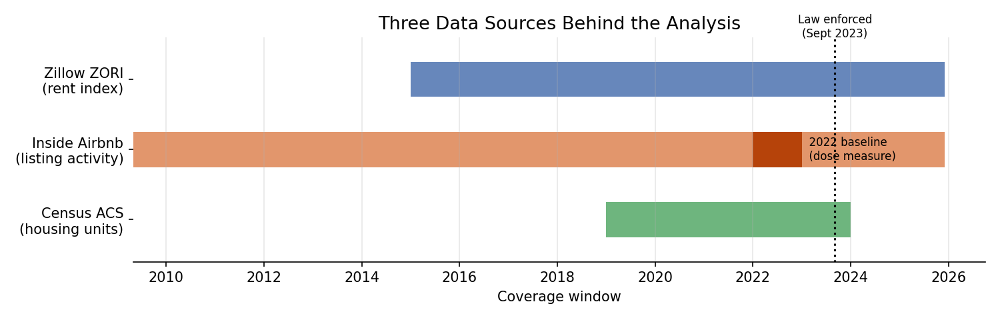
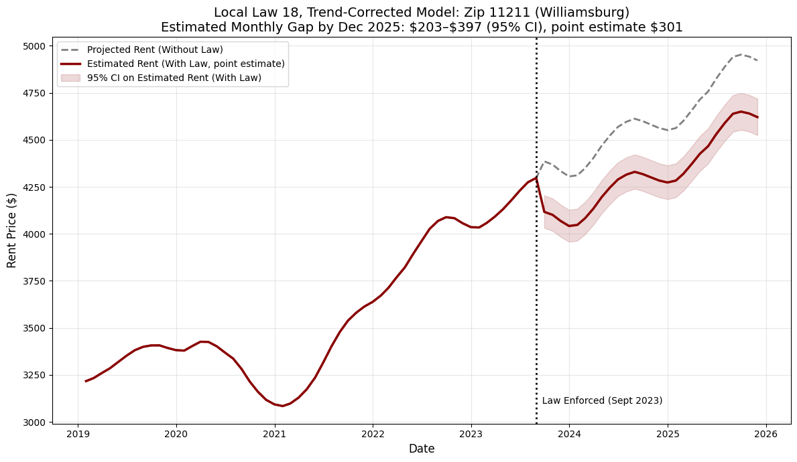

New York City's housing market has faced a prolonged affordability crisis, with median rents rising sharply over the past decade and rental vacancy rates hovering near historic lows. One frequently cited reason for this pressure is the rapid growth of short-term rental platforms like Airbnb, which critics argue pull units out of the long-term rental market and drive up rents for permanent residents. This study attempts to quantify that relationship by evaluating whether the enforcement of Local Law 18, NYC's landmark short-term rental regulation, had a measurable dampening effect on rent prices across the city's zip codes.

Local Law 18 was passed by the NYC City Council in January 2022 and signed into law shortly after. Enforcement began on September 5, 2023, making New York City one of the strictest short-term rental markets in the world. The law requires all short-term rental hosts to register with the Mayor's Office of Special Enforcement, mandates that the host be physically present during any guest stay, and caps occupancy at two guests per rental.

## Data

The data used in this analysis comes from three main sources: Zillow, the U.S. Census Bureau, and Inside Airbnb. Zillow provides the Zillow Observed Rent Index (ZORI), a measure of median rent prices in various geographic areas; I obtained ZORI data for all New York City zip codes from January 2015 to December 2025. Housing unit counts used to normalize Airbnb activity were collected from Census data. Inside Airbnb is a third-party data source that scrapes Airbnb and provides information on all active listings at the time of the scrape. Earlier snapshots exist and are documented, but aren't yet incorporated into this model; as a result, this analysis should be understood to carry some degree of survivorship bias in its listing counts, likely undercounting true activity levels.

## Method

To isolate the law's effect, I compared rent trends in zip codes with heavy Airbnb activity to trends in zip codes with little to none, before and after enforcement began in September 2023. This is a difference-in-differences approach that's commonly used to isolate an effect from a change in the law alone. I also controlled for fixed differences between zip codes and across months, to ensure normal neighborhood and seasonal changes wouldn't affect the results. A key assumption underlying the analysis was that, absent the law affecting Airbnb activity, high- and low-Airbnb zip codes would have kept moving in roughly the same direction. This assumption was found to be incorrect quickly.

## Results

My baseline model comparing rent trends in high- and low-Airbnb zip codes before and after Local Law 18 found no statistically significant effect (p = 0.75). That result is difficult to interpret on its own, however. In reality, zip codes with the most Airbnb activity were already on a different rent trajectory before the law took effect, driven in large part by the uneven COVID-era rent crash and rebound in neighborhoods like lower Manhattan and North Brooklyn.

Once that pre-existing divergence between zip codes' rent trajectories is accounted for, the model finds a negative association between Airbnb intensity and rent growth (0.3–0.65% per unit of Airbnb intensity, 95% confidence interval). This implies the law acted as a mild rent-suppressing effect, concentrated in the highest-intensity neighborhoods.

That said, this corrected estimate should be read as suggestive rather than conclusive. The correction technique I used, a zip-specific time trend, is a standard tool, but it's unable to fully separate the law's effect from COVID-era rent dynamics cooling off on their own. They both predict the same pattern in the data, and the two are difficult to fully disentangle. The Airbnb-activity measure used here is also likely to undercount listings that were removed by the law itself, which could bias the estimated effect in either direction. Addressing the data-quality issue using archival listing snapshots, and applying more formal sensitivity-bound methods to test how much the result depends on the parallel-trends assumption, is the next phase of this project.

## Conclusion

Taken together, the evidence is consistent with Local Law 18 having modestly slowed rent growth in the highest-Airbnb-density neighborhoods, but the magnitude of that effect is hard to quantify with certainty, and a more definitive answer requires a larger dataset and more rigorous testing.